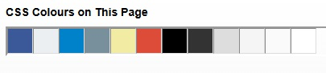
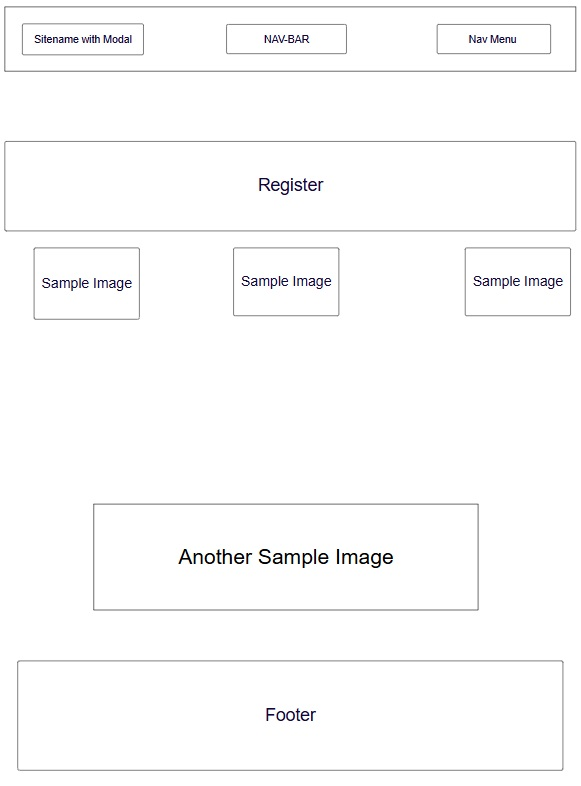
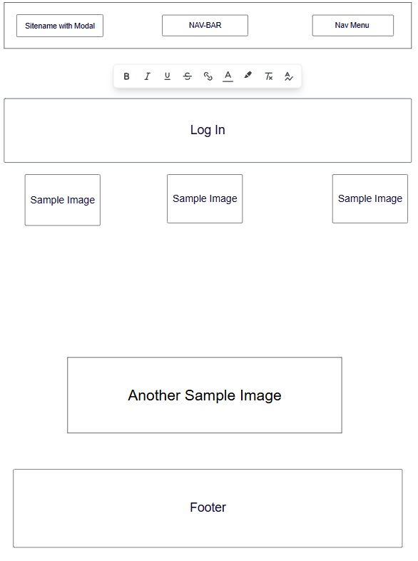
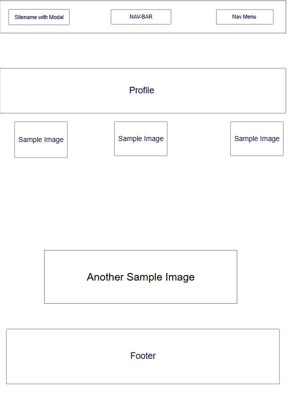
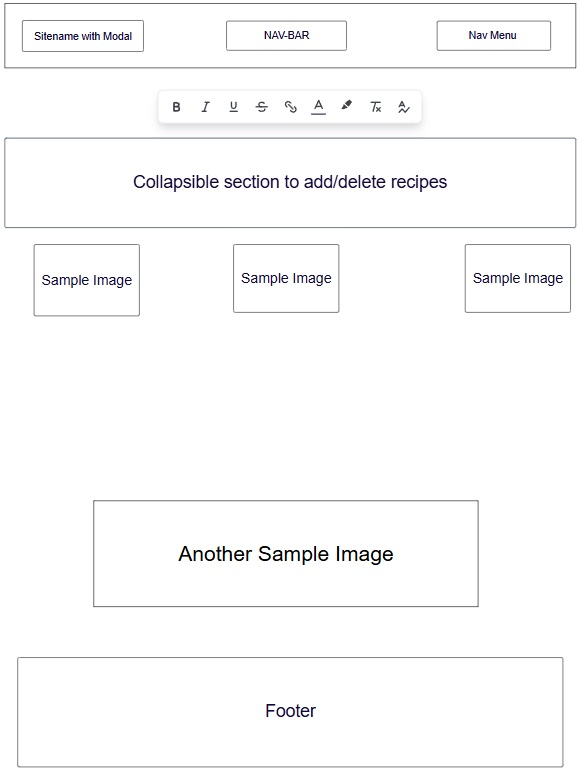
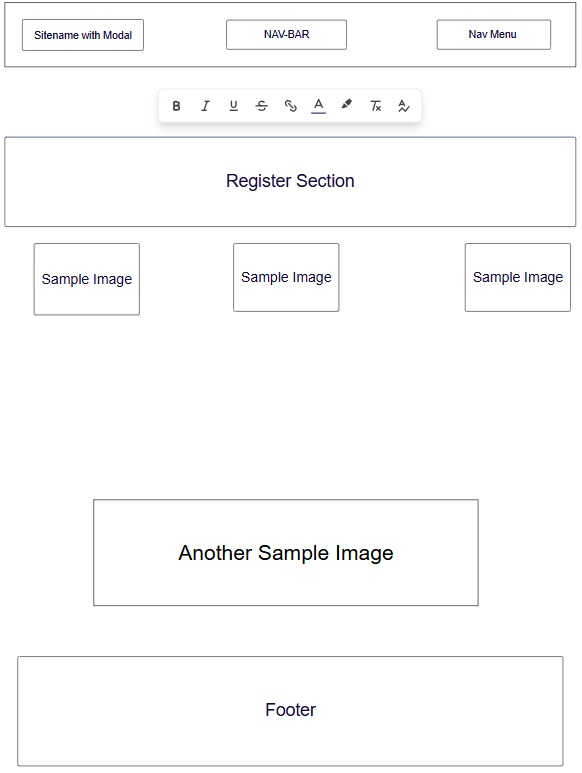

# 📖 Mexicana Milestone Project 3 By Mark Curran

This is my design on a recipe website 

 

### Brief Introduction

I have been intesrested in cooking for a good number of years one particluar recipe is Chilli Con Carne, i have varied the recipe so many times and 
now finally i would say have perfected it. This has inspired me to further my interest and search for and try new recipes.

Having visited Mexico this trip gave me more ideas and inspiration.

This website i feel can be grown with more ideas features etc further down the line.

I have designed this with three main recipe sections :-

1. _Starters_
2. _Mains_ 
3. _Desserts_

---
Mexicana Repo - https://github.com/curran68/mongo-mex.git
## 🌟 Features
- **Core feature 1**: Responsive website aimed at highlighting Mexican food.
- **Core feature 2**: Clean layout, with good functionality designed with clean colours .
- **User management**: Login/registration, with  Werkzeug encryption security.

- **Data operations**: CRUD functionality, allowing the user to register, login update modify and delete recipes with auth checks.

---

## 🛠️ Tech Stack
| Category       | Technologies                          |
| -------------- | ------------------------------------- |
| **Frontend**   | Jinja2, HTML/CSS, jQuery, Materialize |
| **Backend**    | Flask, Python 3.x                     |
| **Database**   | MongoDB (PyMongo)                     |
| **Auth**       | Werkzeug Security                     |
| **Deployment** | Heroku                                |

---

## 🚀 Quick Start
### Software/Technologies Used In This Project.

# Software used

  ## List
  
1. GitHub
2. Microsoft VS Code
3. Python 3.10+
4. MongoDB Atlas account
5. Flask
6. Pymongo
7. Jinja Formatting
8. Heroku
9. Materialize
10. Fontawesome
11. JQuery
12. Werkzeug

Fonts used in this site are from Google Fonts, i have used Two different ones (Joti One and Albert Sans).

### Installation

Repository created in Github, cloned into Microsoft VS Code followed standard procedures.

Process followed, created database in Mongodb to enable Data to be adapted updated etc. Installation of Python Pymongo etc to enable connectivity added routes etc.
Within VS Code created Base templates to allow use of Jinja formatting alongside created extra templates in a static directory and linked accordingly.

As per the wireframes shown below, designed around the materialize responsive format Mexicana logo doubles as a modal to show an extra feature. 
Navbar designed with eyecatching colours/design.
I have created the colour scheme which i feel to be clean and eyecatching.

Colour varaition used is :-

# User Stories - Mexicana Recipe Website

## Visitor User Stories

- As a visitor, I want to browse recipes by category (appetizers, main dishes, desserts) so that I can find recipes that match my current needs.
- As a visitor, I want to view detailed recipe instructions with clear step-by-step guidance, so I can successfully prepare the dish.
- As a visitor, I want to see high-quality images of completed dishes, so I can visualize what I'm making.
- As a visitor, I want to adjust serving sizes, so I can cook for different numbers of people.

## Registered User Stories

- As a registered user, I want to save my favorite recipes, so I can easily find them later.
- As a registered user, I want to create shopping lists based on recipes, so I can efficiently plan my grocery shopping.

## Recipe Contributor Stories

- As a contributor, I want to submit my own recipes to the site, so I can share my culinary creations with others.
- As a contributor, I want to edit recipes I've submitted, so I can improve them based on feedback.
- As a contributor, I want to categorize my recipes appropriately, so users can find them easily.
- As a contributor, I want to include preparation and cooking times, so users know how long a recipe takes.
- As a contributor, I want to upload photos to provide an example of the finished dish.

## Wireframes

## Validation Tests

